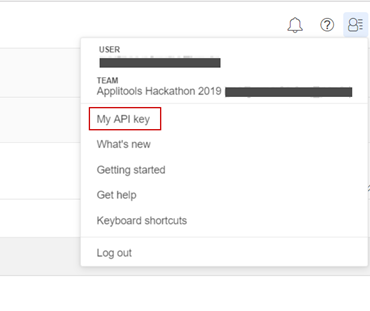

# hackaton-applitools

The project uses WebdriverIO, Applitools eyes and Cucumber to provide UI automation tests for 
5 tasks presented in the Applitools hackhaton (https://applitools.com/hackathon-instructions).  
All tasks were automated in traditional manner using only WebdriverIO.  
And then they were automated again using WebdriverIO and Applitools eyes.

## Requirements
Node.js version `10.16.3` or higher (https://nodejs.org/en/).  
Once downloaded it will also download npm (node package manager) for you.  
npm version `6.12.0` or higher.

In order to check node version, type into command prompt or terminal:

        node --version
In order to check npm version, type into command prompt or terminal:

        npm --version

## Quick start
To run the test do following:
1. clone the repo with the command:  

       git clone https://github.com/mareru/hackaton-applitools.git
2. change the directory to position yourself in the root folder of the project (`hackaton-applitools`) and install dependencies with the command:

        npm install
3. for the applitools test suite to run you need to set environment variable APPLITOOLS_API_KEY_HACKATHON:

        Mac: export APPLITOOLS_API_KEY_HACKATHON='YOUR_API_KEY'
        Windows: set APPLITOOLS_API_KEY_HACKATHON='YOUR_API_KEY'
   You can get the key by creating the account on the https://applitools.com/users/register .  
   Once you create the account and log in to the Applitools Eyes Test Manager application, there you can find the key value.  
   
   
4. In order to run traditional test suite for version 1 of the app use command:
        
        npm run traditionalversion1
   In order to run traditional test suite for version 2 of the app use the command:
   
        npm run traditionalversion2
   In order to run applitools test suite for version 1 of the app use the command:
    
        npm run applitoolsversion1
   In order to run applitools test suite for version 2 of the app use the command:
   
        npm run applitoolsversion2
5. if you want to run only the specific feature file, then open wdio.conf.js file and comment everything in the specs section except that feature file. 
For example, to run tests for the second task (Data-Driven Test):  
    1. open wdio.conf.js
    2. uncomment feature file for that task (for traditional and applitools version) and comment everything else in specs section:
     
            specs: [
            // './src/features/**/*.feature',
    
            // './src/features/traditional/*.feature',
            // './src/features/traditional/loginPageUIElements.feature',
             './src/features/traditional/loginPageDataDriven.feature',
            // './src/features/traditional/tableSort.feature',
            // './src/features/traditional/canvasChart.feature',
            // './src/features/traditional/dynamicContent.feature',
    
            // './src/features/applitools/*.feature',
            // './src/features/applitools/loginPageUIElements.feature',
             './src/features/applitools/loginPageDataDriven.feature',
            // './src/features/applitools/tableSort.feature',
            // './src/features/applitools/canvasChart.feature',
            // './src/features/applitools/dynamicContent.feature'
            ],
        Each task has its own feature file in 2 flavors: traditional one and applitools one.
        This is the list:
        1. Login Page UI Elements Test:
        
                ./src/features/traditional/loginPageUIElements.feature
                ./src/features/applitools/loginPageUIElements.feature
        2. Data-Driven Test:
        
                ./src/features/traditional/loginPageDataDriven.feature
                /src/features/applitools/loginPageDataDriven.feature
        3. Table Sort Test:
        
                ./src/features/traditional/tableSort.feature
                ./src/features/applitools/tableSort.feature
        4. Canvas Chart Test:
        
                ./src/features/traditional/canvasChart.feature
                ./src/features/applitools/canvasChart.feature
        5. Dynamic Content Test:
                
                ./src/features/traditional/dynamicContent.feature
                ./src/features/applitools/dynamicContent.feature
